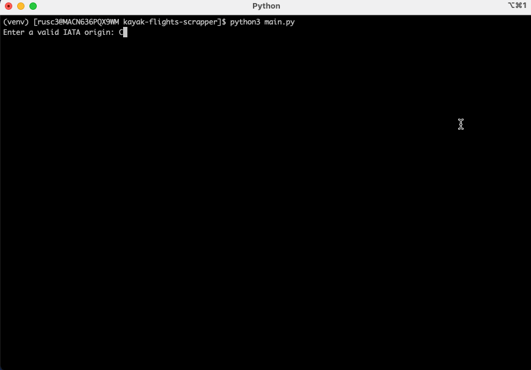

# Web scraping KAYAK

Web scraping flights info from https://ro.kayak.com with Python.

### Instructions:

* run `main.py` and feed some valid input.
* chromedriver is automatically installed based on the OS
* chrome browser must be installed.

### requirements

* Python 3.8
* create a virtual environment `python3 -m venv venv` and install the dependencies from 
* `pip install -r requirements.txt `

### Screen capture

* When running the script, Chrome will open in the background (you can ignore it).

### Disclaimer
Inspired from https://github.com/manuelsilverio/scraping_kayak
